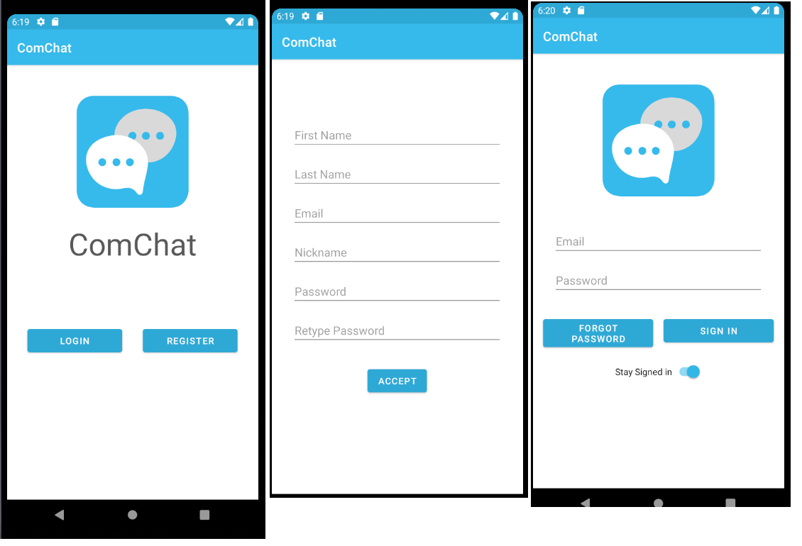
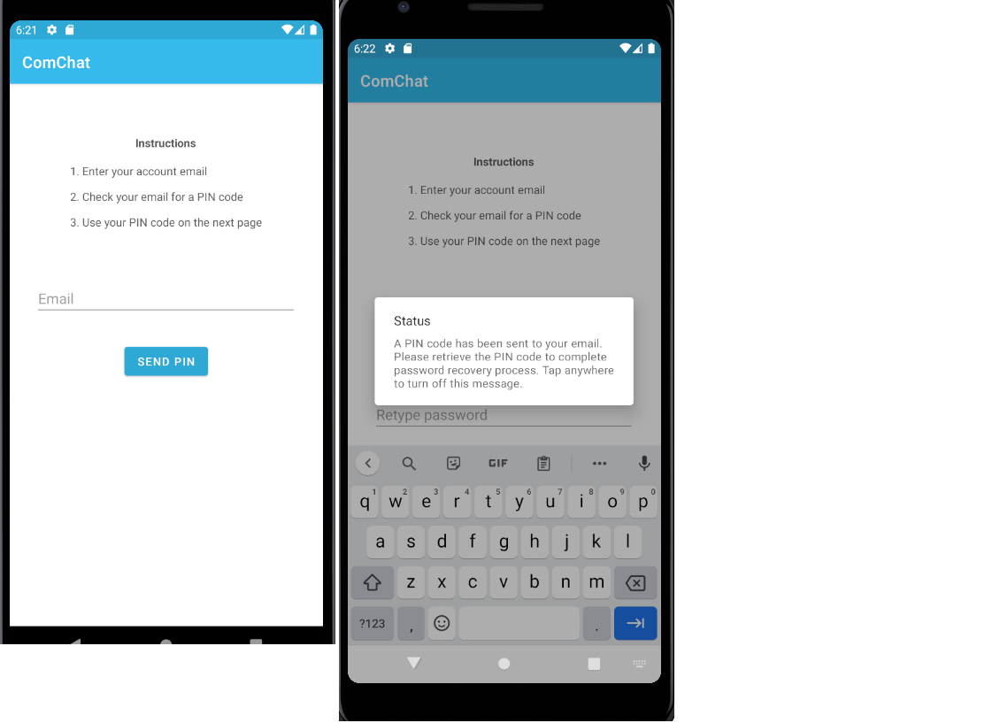
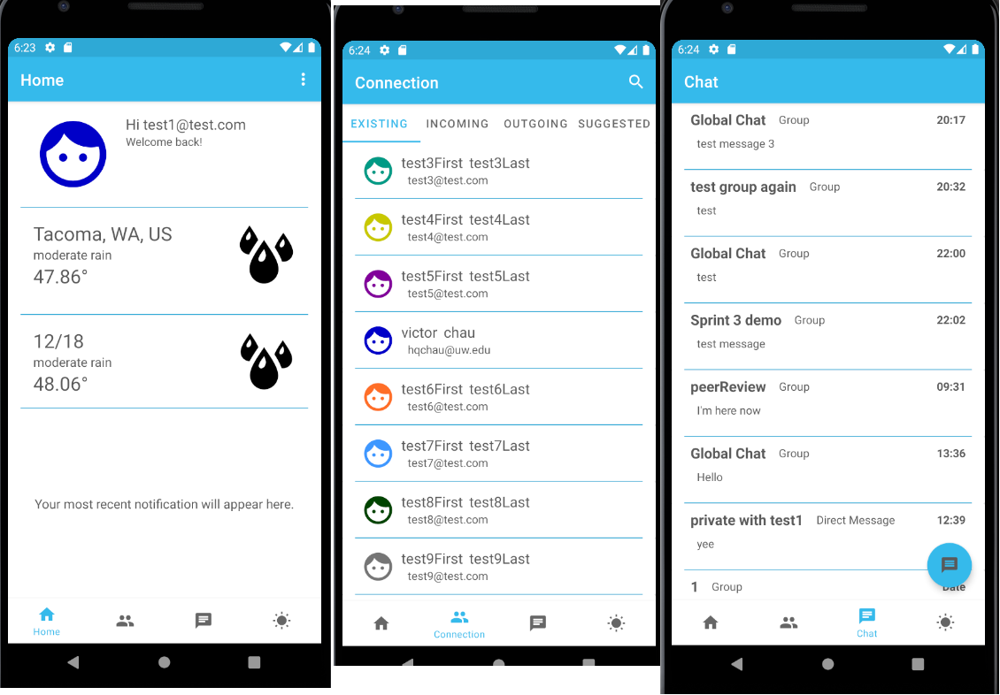
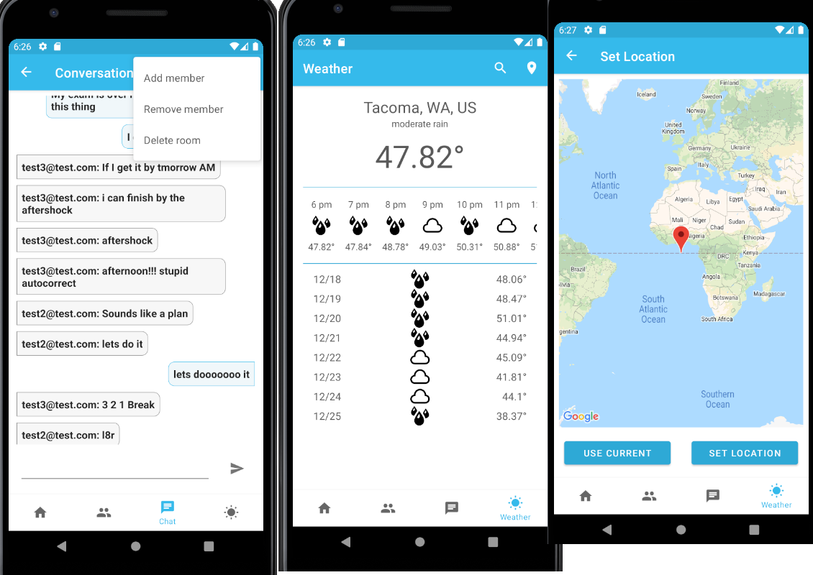

# Com Chat

- An Android messaging app, which allows users to chat together using Internet.
- Some notable functionalities:
  1. Users can register, recover, and login to their personal account. Some processes will reuqire an email verification steps.
  2. Users can view weather forecast based on their current location, or provided location (ZIP code or select on Google Map).
  3. Users can add/delete contact, or search other account.
  4. Users can create a group chat room or a direct message to another user.
  5. Themes are changeable.

- Web service of the project: <https://github.com/hunghvu/com-chat-web-service>
- **Application presentation video**: <https://drive.google.com/file/d/13Hld0EJD6QmRwp7x6ubCj7GuGn89VRnE/view?usp=sharing>

## Installation and Execution

- **Note:** All required dependencies are included. The app requires API 26 at minimum.
- Steps:
  1. Clone the repository.
  2. The cloned repository itself is an Android project, open it in Android Studio.
  3. Run it on an emulator.
  4. Done.

- Alternatively, you can install this application by dropping the apk file into your emulator, or directly install it on a real Android device.

## User Interface Examples

### Login and Register

 
 
 

### Password Recovery

 
 
 

### Home, Connection and Chat Pages

 
 
 

### Inside Group Chat Room, Weather and Map Pages

## Contributors

- Hung H. Vu
- Adam Hall
- Jerry J. Springer
- Phong H. Le
